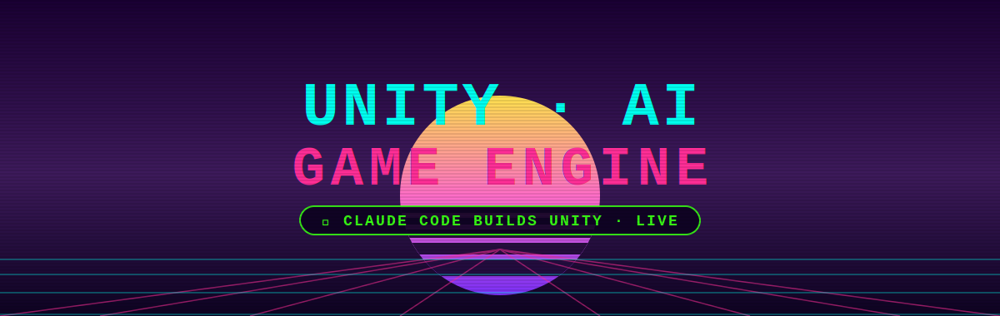
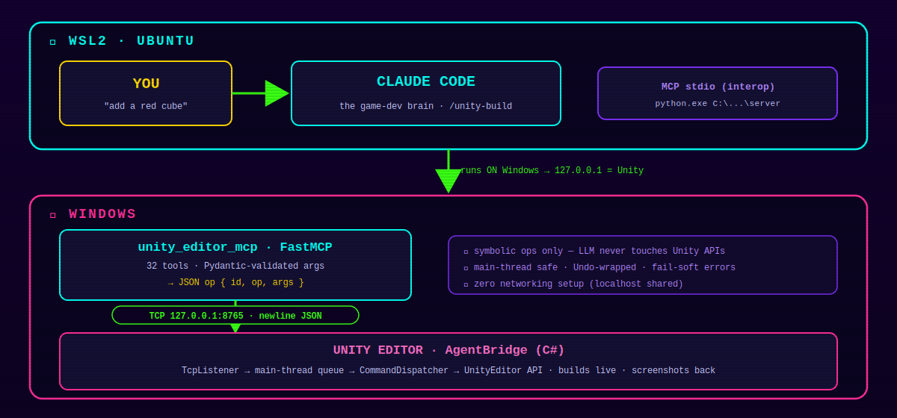
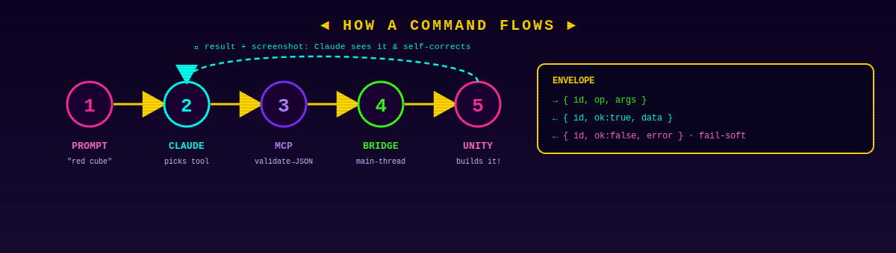
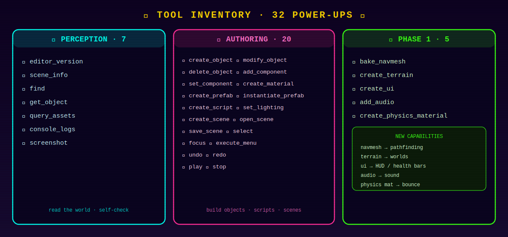
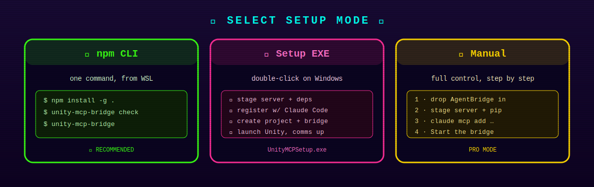
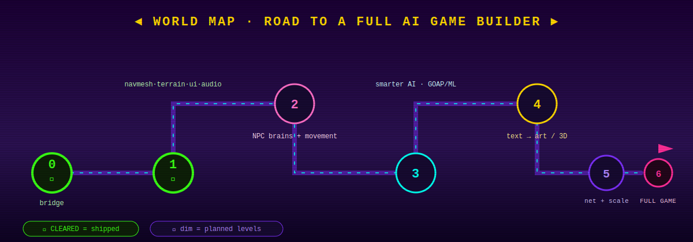

<p align="center">
  
</p>

<p align="center">
  
  
  
  
  
</p>

# unity-ai-game-engine

**Claude Code as a live Unity game developer.** You describe what you want in plain English —
*"add a red bouncing ball", "build a night forest", "give the player a jump script", "make a health
bar"* — and Claude **builds it live in your open Unity Editor**: GameObjects, materials, terrain,
lighting, UI, audio, physics, NavMesh, and behaviour scripts appear in the Scene view as it works.
Claude takes screenshots to see the result and self-corrects.

The bridge runs Claude Code in **WSL** and the Unity Editor on **Windows**, connected through an MCP
server. It ships with a one-command **npm CLI**, a one-click **Windows setup exe**, and 32 tools.

---

## Table of contents

- [What it does](#what-it-does)
- [Architecture](#architecture)
- [How a command flows](#how-a-command-flows)
- [Why this WSL ⇄ Windows split](#why-this-wsl--windows-split)
- [Repository layout](#repository-layout)
- [Tool catalog (32)](#tool-catalog-32)
- [Setup](#setup)
- [Using it](#using-it)
- [Verification](#verification)
- [Skill library (the memory map)](#skill-library-the-memory-map)
- [Agent-to-agent workflow — build a full game](#agent-to-agent-workflow--build-a-full-game)
- [Roadmap](#roadmap)
- [Troubleshooting](#troubleshooting)
- [Design notes & gotchas](#design-notes--gotchas)
- [License](#license)

---

## What it does


- **Authoring, live in the Editor.** Create/modify objects, materials, prefabs, scenes, terrain, UI,
  lighting, audio, physics materials, and full C# scripts — while you watch, without pressing Play.
- **Perception + self-correction.** Claude reads the scene hierarchy, inspects objects, reads the
  console (to catch compile errors), and takes **screenshots** to visually verify what it built.
- **Research-then-build.** The `/unity-build` skill web-searches the latest Unity API when needed and
  consults Unity's real source for exact signatures before writing C# (so generated code compiles).
- **Undoable.** Every change is wrapped in Unity's Undo — **Ctrl-Z undoes Claude**.
- **Turnkey install.** `unity-mcp-bridge` (npm) or `UnityMCPSetup.exe` wires up the whole thing.

---

## Architecture

<p align="center"></p>

<details><summary>Text version of the diagram</summary>

```
┌──────────────────────────────── WSL2 (Ubuntu) ─────────────────────────────────┐
│                                                                                  │
│    You ──▶  Claude Code  ◀── the "game developer" brain (+ WebSearch/WebFetch)   │
│                  │                                                               │
│                  │  MCP over stdio, launched via WSL interop:                    │
│                  │      python.exe  C:\Users\<you>\unity-mcp\server\...py         │
└──────────────────┼───────────────────────────────────────────────────────────────┘
                   │   (the command is a Windows exe, so the process runs on Windows)
┌──────────────────▼───────────────────────── Windows ─────────────────────────────┐
│                                                                                   │
│   unity_editor_mcp   —  FastMCP server (Python)                                    │
│     • 32 tools: perception (read-only) + authoring (write)                         │
│     • Pydantic-validated args  ──▶  JSON op  { id, op, args }                      │
│                  │                                                                 │
│                  │   TCP  127.0.0.1:8765   (newline-delimited JSON)                │
│                  ▼                                                                 │
│   Unity Editor  ──  AgentBridge  (C# Editor extension, runs in Edit mode)          │
│     • TcpListener on a background thread                                           │
│     • main-thread command queue drained in EditorApplication.update               │
│       (UnityEditor APIs are main-thread only)                                      │
│     • CommandDispatcher:  op  ──▶  UnityEditor / AssetDatabase / EditorSceneMgr    │
│     • builds live in the Scene view; returns data / PNG screenshots to Claude      │
│     • "Agent Bridge" EditorWindow shows status + a live log of every command       │
│                                                                                   │
└───────────────────────────────────────────────────────────────────────────────────┘
```

</details>

**Three processes, one loop:** Claude Code (WSL) reasons and calls tools → the Python MCP server
(Windows) validates and relays them as symbolic ops → the C# bridge (inside Unity) executes them on
the Editor's main thread and returns results. The LLM never touches Unity APIs directly; it only
emits ops from a fixed, validated vocabulary — safe, debuggable, and deterministic.

---

## How a command flows

<p align="center"></p>

<details><summary>Text version of the diagram</summary>

```
"create a red cube at origin"
        │
        ▼
Claude Code picks a tool:  unity_create_object { primitive:"cube", color:[1,0,0], position:[0,0,0] }
        │  (MCP stdio)
        ▼
unity_editor_mcp  validates args (Pydantic) → sends JSON line:
        {"id":"…","op":"create_object","args":{…}}          ──TCP 127.0.0.1:8765──▶
        │
        ▼
AgentBridge (Unity):  background thread reads the line → enqueues it →
        EditorApplication.update dequeues on the main thread →
        CommandDispatcher → AuthoringOps.CreateObject →
        GameObject.CreatePrimitive(Cube) + material + Undo + MarkSceneDirty + RepaintAllViews
        │
        ▼  {"id":"…","ok":true,"data":{"id":-1738,"name":"Cube","path":"Cube"}}
Claude sees the result, optionally calls unity_screenshot to look at it, and reports back.
```

</details>

Envelope (both directions):

```
request :  { "id": "<uuid>", "op": "create_object|perceive|…", "args": { … } }
response:  { "id": "<uuid>", "ok": true,  "data":  { … } }
        |  { "id": "<uuid>", "ok": false, "error": "actionable message" }
```

Errors are **soft**: unknown ops, bad targets, missing packages → structured error strings the agent
can read and retry, never a crash.

---

## Why this WSL ⇄ Windows split


Unity runs on Windows; Claude Code runs in WSL. WSL's `localhost` does **not** reach the Windows host
by default (NAT networking). Instead of configuring networking, the **MCP server runs on Windows**,
launched by Claude Code through WSL interop (`python.exe …`). Because that process is on Windows, it
shares `127.0.0.1` with Unity — the TCP bridge "just works" with **zero networking setup**.

The server code is staged to a real `C:\` path (not run over the `\\wsl.localhost` share) because a
Windows process launched from a WSL-share working directory can't reliably resolve those UNC paths.
The npm CLI and setup exe handle this automatically.

---

## Repository layout


```
unity-ai-game-engine/
├── bin/cli.js                       # npm CLI: `unity-mcp-bridge` (check / build / setup / run)
├── package.json                     # npm package manifest
├── server/                          # the MCP server (runs on Windows)
│   ├── unity_editor_mcp.py          #   FastMCP server, 32 tools, stdio + --http
│   ├── unity_client.py              #   async TCP client to the bridge (id-correlated, reconnect)
│   ├── schemas.py                   #   Pydantic v2 input models (one per tool)
│   └── requirements.txt             #   mcp[cli], pydantic
├── unity/Assets/AgentBridge/Editor/ # the C# Editor bridge — drop into your Unity project
│   ├── AgentBridgeServer.cs         #   TcpListener + main-thread queue + autostart
│   ├── CommandDispatcher.cs         #   op → handler routing; JSON envelope
│   ├── AuthoringOps.cs              #   create/modify/component/material/prefab/scene/script/
│   │                                #   navmesh/terrain/ui/audio/physics-material
│   ├── SceneQuery.cs                #   scene_info / find / get_object / console_logs / version
│   ├── Screenshot.cs                #   Scene/Game view → PNG
│   ├── BridgeUtil.cs                #   arg parsing, object/type resolution, reflection helpers
│   ├── Json.cs                      #   dependency-free JSON (MiniJSON)
│   ├── AgentBridgeWindow.cs         #   "Agent Bridge" EditorWindow (status + live log)
│   └── AgentBridge.Editor.asmdef    #   editor-only assembly definition
├── setup/
│   ├── UnityMCPSetup.cs             #   one-click Windows installer (C# source)
│   ├── UnityMCPSetup.exe            #   …compiled with the built-in .NET csc (no installs)
│   └── build_exe.sh                 #   rebuild the exe
├── scripts/
│   ├── setup_windows.ps1            #   stage server + install deps (PowerShell)
│   └── smoke_test.py                #   transport test (`--stub` needs no Unity)
├── .claude/skills/unity-build/      #   the research → build → screenshot-verify skill
├── Integration-plan.md              #   phased roadmap toward a full AI game builder
└── prompt.md                        #   original design brief
```

---

## Tool catalog (32)

<p align="center"></p>

**Read-only (perception)** — `readOnlyHint: true`
| Tool | Purpose |
|---|---|
| `unity_editor_version` | Unity version + render pipeline (URP/HDRP/Built-in) + bridge support check |
| `unity_scene_info` | Active scene + GameObject hierarchy |
| `unity_find` | Find objects by name / tag / component |
| `unity_get_object` | Full detail of one object (transform + components + properties) |
| `unity_query_assets` | Search project assets (AssetDatabase filter) |
| `unity_console_logs` | Recent console + compiler messages (catch compile errors) |
| `unity_screenshot` | Capture Scene or Game view as a PNG |

**Authoring (write)** — core
| Tool | Purpose |
|---|---|
| `unity_create_object` | Primitive/empty GameObject + transform + parent + color |
| `unity_modify_object` | Rename / move / rotate / scale / reparent / retag / active |
| `unity_delete_object` | Destroy (undoable) |
| `unity_add_component` / `unity_set_component` | Add/edit any component + serialized fields |
| `unity_create_material` | Material (shader + color + metallic/smoothness), optional assign |
| `unity_create_prefab` / `unity_instantiate_prefab` | Save/instantiate prefabs |
| `unity_create_script` | Write a C# script (+ optional attach after compile) |
| `unity_set_lighting` | Ambient / skybox / fog / sun (directional light) |
| `unity_create_scene` / `unity_open_scene` / `unity_save_scene` | Scene management |
| `unity_select` / `unity_focus` | Select / frame an object in the Editor |
| `unity_execute_menu` | Escape hatch: invoke any Editor menu item |
| `unity_undo` / `unity_redo` | Undo / redo |
| `unity_play` / `unity_stop` | Enter / exit Play mode |

**Authoring (write)** — Phase 1 richer authoring
| Tool | Purpose |
|---|---|
| `unity_bake_navmesh` | Bake a NavMesh over scene geometry (for NavMeshAgents) |
| `unity_create_terrain` | Terrain + TerrainData (size / resolution) |
| `unity_create_ui` | uGUI element: text / button / image / slider (health bars) / panel / canvas |
| `unity_add_audio` | AudioSource + AudioClip on an object |
| `unity_create_physics_material` | Friction + bounciness, assignable to a collider |

Every tool input is a Pydantic model with described, constrained fields, and carries MCP annotations
(`readOnlyHint`, `destructiveHint`, `idempotentHint`, `openWorldHint`).

---

## Setup

<p align="center"></p>

Prerequisites: **WSL2 + Ubuntu**, **Windows Python 3.11+**, **Node 16+** (in WSL), and **Unity Hub +
a Unity 6 (6000.x) Editor**. The CLI checks all of these for you.

### Option A — npm (install from git, auto-connects)

Install straight from the repo so you can pull new features later with `npm update`. From **WSL**:

```bash
npm install -g github:MoblyJ/unity-ai-game-engine-0#main
```

On install, a **postinstall** step runs automatically and:

- **Registers the MCP server with Claude Code** (`unity-editor`, user scope) — no manual `claude mcp add`.
- Stages the server to `%USERPROFILE%\unity-mcp\server` and installs `mcp` + `pydantic` on Windows Python.
- Drops **`~/UnityMCPSetup.exe`** in your WSL home — copy it to Windows and run it to wire up the Unity side.

Then **reload Claude Code** (`/mcp`) so the `unity_*` tools load.

Commands: `check` · `connect` (re-run the auto-connect) · `link <projectPath>` (remember a Unity project
so updates refresh its bridge) · `build` · `setup` · `run` · `help`.

> The repo must be **public** (or use a git token) for other machines to `npm install` it.
> Opt out of the auto-connect with `UNITY_MCP_NO_POSTINSTALL=1`; override scope with `UNITY_MCP_SCOPE=local|project|user`.

### Updating (get new features)

Because it's installed from git, pushing changes to the repo lets any host pull them:

```bash
npm update -g unity-mcp-bridge      # re-runs postinstall: re-stages server, refreshes exe + bridge, re-registers
# (or reinstall to force the latest commit:)
npm install -g github:MoblyJ/unity-ai-game-engine-0#main
```

The update re-stages the **server** and **exe** automatically. To also refresh the in-project **C# bridge**
on every update, link your project once:

```bash
unity-mcp-bridge link "C:\Users\<you>\ClaudeGame"
```

Then restart Unity after an update so it recompiles the new bridge. (Bump `version` in `package.json`
on each change so `npm outdated`/semver installs see the new release.)

### Option B — Windows setup exe

Run `C:\Users\<you>\unity-mcp\setup\UnityMCPSetup.exe` (or `setup/UnityMCPSetup.exe`). It: locates
Windows Python → stages the server to your profile → installs `mcp` + `pydantic` → **registers the
MCP server with Claude Code** → offers to install Unity Hub if missing → optionally **creates a Unity
project (adds uGUI) and injects the bridge**, launching Unity with the bridge listening automatically.

### Option C — Manual

1. Install Unity Hub + a 6000.x Editor; create a **3D** project on `C:\`.
2. Copy `unity/Assets/AgentBridge` into the project's `Assets/`. Open **Window ▸ Agent Bridge ▸ Start**
   (tick *Auto-start on load*). You should see `● LISTENING 127.0.0.1:8765`.
3. Stage the server + install deps on Windows:
   ```bash
   mkdir -p /mnt/c/Users/<you>/unity-mcp && cp -r server /mnt/c/Users/<you>/unity-mcp/
   python.exe -m pip install --user "mcp[cli]>=1.2.0" "pydantic>=2.6"
   ```
4. Register with Claude Code (run in WSL):
   ```bash
   claude mcp add unity-editor -- python.exe "C:\Users\<you>\unity-mcp\server\unity_editor_mcp.py"
   ```

**After any option: reload Claude Code** so the `unity_*` tools load into the session.

> **Port:** default `8765`. Change it in the Agent Bridge window **and** pass `-e UNITY_BRIDGE_PORT=…`
> when registering the server.

---

## Using it


Just ask — or invoke `/unity-build <request>` explicitly:

- *"Check the editor version, then create a red cube at origin and screenshot it."*
- *"Ground plane + a bouncing ball with a Rigidbody and a bouncy physics material."*
- *"Write a script that spins the selected object and attach it."*
- *"Make it night: dark ambient, blue fog, low sun."*
- *"Add a health-bar slider and a 'Play' button to a canvas."*
- *"Create a terrain and bake a navmesh over it."*

Claude builds via the tools, checks `unity_console_logs` for a clean compile, and `unity_screenshot`
to confirm the result — iterating until it matches your request.

---

## Verification


**Without Unity** (proves the Python transport + framing + error handling):

```bash
python -m py_compile server/*.py
python scripts/smoke_test.py --stub                 # → PASS: stub round-trip …
npx @modelcontextprotocol/inspector python server/unity_editor_mcp.py   # lists all 32 tools
```

**With Unity** (end-to-end): open the project + Start the bridge, then from WSL
`python scripts/smoke_test.py` returns real scene JSON. In Claude Code, *"create a red cube"* → the
cube appears in the Scene view and `unity_screenshot` returns the image.

---

## Skill library (the memory map)

Beyond the 32 low-level tools, the package ships **10 skills** in `.claude/skills/` that distil the 13
studied open-source engines in `repo/` into reusable, token-efficient recipes — so Claude builds any game
from *verified patterns* instead of guessing, and without loading whole repos into context. Skills
auto-load into Claude Code and also import into the **engine-ai** registry
(`import_repo_skills(".claude/skills")`).

| Skill | Role — what it does | Backing repo(s) in `repo/` | Install / license |
|---|---|---|---|
| **`unity-game-builder`** | **Master router / memory map.** Decomposes any game request and routes each feature → the right capability skill → the proven repo → a grounded `search_repo` query. Start here for anything bigger than primitives. | all of the below | — |
| **`unity-build`** | Build tangible things live: objects, materials, lighting, terrain, UI, and gameplay C#. The research → build → screenshot-verify loop. | `UnityCsReference` | — |
| **`unity-npc-behavior`** | NPC decision brains with **behavior trees** — patrol/chase/attack, states, reactions. | `fluid-behavior-tree`, `NPBehave` | copy folder / scoped UPM · MIT |
| **`unity-npc-goap`** | **Goal-oriented action planning** — declare goals + actions, the planner chains steps (gather→craft→eat). | `GOAP` | UPM git URL · Apache-2.0 |
| **`unity-npc-movement`** | **Steering/locomotion** — seek, flee, wander, pursue, flocking, obstacle & wall avoidance, path follow. | `unity-movement-ai` | copy `Scripts/` · MIT |
| **`unity-multiplayer`** | **Netcode for GameObjects** — synced state, RPCs, networked spawning (co-op, online 1v1). | `com.unity.netcode.gameobjects` | UPM · Unity Companion |
| **`unity-ecs-performance`** | **DOTS/ECS/Burst** for thousands of entities; recommends object pooling for lighter cases. | `EntityComponentSystemSamples` | UPM · Unity Companion |
| **`unity-ml-agents`** | **Reinforcement-learning** NPC scaffolding + the Python training handoff. | `ml-agents` | UPM + `pip mlagents` · Apache-2.0 |
| **`unity-api-lookup`** | Verify the **exact current Unity 6 API** (signatures, enums, obsolete-as-error) before writing C#. | `UnityCsReference` | reference-only (never ship) |
| **`unity-subsystems`** | Find a proven **niche subsystem** (pooling, save, inventory, procgen, dialogue) in the curated indexes. | `awesome-unity3d`, `AwesomeUnityCommunity`, `ai-game-devtools` | varies |

**Grounded memory (efficient by design):** the small gameplay repos (`NPBehave`, `fluid-behavior-tree`,
`unity-movement-ai`, `GOAP`) are indexed with `index_repo`, so a skill pulls the *exact* current API via
`search_repo(path, query)` on demand instead of reloading source. Large repos index on demand or via a
targeted `grep`. Every skill is license-aware: MIT/Apache → copyable into the project; Unity Companion →
install via UPM; `UnityCsReference` → read to verify, never copy/ship.

## Agent-to-agent workflow — build a full game

The package ships **12 Claude Code sub-agents** in `.claude/agents/` (they appear under **`/agents`** after a
Claude Code reload). It's a team modeled on **Google ADK** multi-agent patterns (Coordinator/Dispatcher +
Sequential / Parallel / Loop, generator–critic) and the **Claude Agent SDK** per-agent system-prompt +
tool-scope model. Each agent defers implementation detail to its matching skill, so the director hands out
*features + acceptance tests*, not code.

**Orchestrator**

| Agent | Role | Model | Tools |
|---|---|---|---|
| **`game-director`** | The **Coordinator**. Decomposes a game prompt into features, delegates each to a specialist (via the Task tool), fans out independent work in **parallel**, then loops **build → playtest → fix** until the playtester confirms it works. | inherit (Opus) | all + Task |

**Design & build specialists**

| Agent | Role | Model | Tools |
|---|---|---|---|
| **`game-designer`** | Turns the prompt into a concrete **build plan**: core loop, feature→owner table, build order, scope call. Plans only — never builds. | inherit | all |
| **`unity-scene-builder`** | The **hands**: arena/level, player, props, materials, lighting, terrain, UI/HUD, and gameplay C# via the `unity_*` tools. Exposes hooks (Player tag, spawn points) for the AI specialists. | sonnet | all (incl. `unity_*`) |
| **`npc-brain-engineer`** | Enemy/NPC **decision-making** — behavior trees (`unity-npc-behavior`) or GOAP (`unity-npc-goap`). Writes + wires the brain; pairs with the movement engineer. | sonnet | all |
| **`movement-engineer`** | NPC **locomotion** — steering behaviors (`unity-npc-movement`) or NavMesh. The "legs" under a brain. | sonnet | all |
| **`multiplayer-engineer`** | **Networked play** with Netcode — NetworkManager, `NetworkVariable`, RPCs, spawning. Only when the prompt wants online. | sonnet | all |
| **`performance-engineer`** | **Scale** — DOTS/ECS for thousands of entities, or recommends object pooling for lighter cases. | sonnet | all |
| **`ml-agents-engineer`** | **Learned behavior** — scaffolds an ML-Agents `Agent` + components + config, then hands off the Python training loop. | sonnet | all |

**Read-only support & verification**

| Agent | Role | Model | Tools |
|---|---|---|---|
| **`unity-api-verifier`** | Confirms the **exact Unity 6 API** by grepping `repo/UnityCsReference` before any C# is written; flags obsolete-as-error members. | sonnet | Bash, Read, Grep, Glob |
| **`subsystems-scout`** | Finds a **proven niche system** (pooling, save, inventory, procgen…) by searching the curated `awesome-*` indexes. | sonnet | Bash, Read, Grep, Glob |
| **`game-research-agent`** | **Web-researches** the latest, non-deprecated Unity technique when local repos aren't enough. | sonnet | WebSearch, WebFetch, Read, Bash, Grep, Glob |
| **`unity-playtester`** | The **critic** in the generator–critic loop: enters Play mode, drives real input (keys/mouse), samples telemetry + screenshots, and reports **PASS/FAIL** per acceptance test. | sonnet | all (incl. `unity_*`) |

**Run it:** *"use game-director to build a 1v1 FPV fighting game."* The director calls `game-designer` for
the plan, `unity-scene-builder` for the foundation, fans out `npc-brain-engineer` + `movement-engineer`,
then loops with `unity-playtester` until it passes.

> **Note:** custom agents (like MCP servers) load at Claude Code **startup** — after installing/updating,
> reload Claude Code (`/agents` or restart) before delegating to them. Until then the orchestration can be
> driven from the main session using the Task tool.

---

## Roadmap

<p align="center"></p>

See **[Integration-plan.md](Integration-plan.md)** for the full plan. Summary:

| Phase | Adds | Status |
|---|---|---|
| 0 | Live authoring bridge | ✅ Done |
| 1 | Richer authoring (navmesh, terrain, UI, audio, physics) + API-accuracy lookup | ✅ Done |
| 2 | NPC brains + movement (Behavior Trees / GOAP + steering) | Planned |
| 3 | Smarter AI (GOAP, ML-Agents) | Planned |
| 4 | Generate content from text (textures / 3D / shaders) | Planned |
| 5 | Multiplayer (Netcode) + scale (DOTS/ECS) | Planned |
| 6 | One prompt → full playable game | Planned |

---

## Troubleshooting


- **`⚠️ Cannot reach the Unity bridge`** — Unity isn't open, or the Agent Bridge window isn't Started,
  or the port differs. Confirm it shows `● LISTENING`.
- **Tools not in Claude Code** — MCP servers load at startup; **reload Claude Code**. Or Windows Python
  is missing deps (re-run setup), or the registered path is wrong.
- **Unity is in "Safe Mode"** — a script didn't compile. Check `unity_console_logs` / the Console.
  Fix the script and re-copy; a fresh Unity launch forces a clean recompile.
- **UI tools say "menu unavailable"** — the project lacks `com.unity.ugui`. Add it to
  `Packages/manifest.json` (`"com.unity.ugui": "2.5.0"`). The setup exe does this for new projects.
- **Materials look pink** — shader mismatch. Pass `shader:"Standard"` for Built-in RP, or the URP Lit
  path for URP. `unity_editor_version` reports your render pipeline.
- **Testing the bridge from WSL fails but the MCP works** — WSL `python3` hits WSL's localhost, which
  can't reach the Windows bridge. Test with Windows `python.exe`, or just use the MCP tools.

---

## Design notes & gotchas


Hard-won lessons baked into the code (so they don't bite again):

- **Unity 6 renamed APIs to hard errors.** `Object.GetInstanceID()` and `PhysicMaterial` are
  `[Obsolete(error:true)]` in 6.x. The bridge calls them via **reflection** (`BridgeUtil.Iid`,
  `FindType`) so it compiles on 2022.3 LTS, 6.0 LTS, and 6.5 alike.
- **UI menu paths changed.** Unity 6.5's uGUI uses `GameObject/UI (Canvas)/…` (not `GameObject/UI/…`).
  `unity_create_ui` tries the new paths with fallbacks.
- **UNC from a WSL cwd.** A Windows process launched from a `\\wsl.localhost` working directory can't
  resolve those UNC paths — so the server is staged to `C:\` and the CLI spawns the exe with a `C:\`
  cwd.
- **Recompiles need focus.** Unity only re-imports changed scripts on Editor focus. To deploy bridge
  changes deterministically, restart Unity (fresh launch = clean compile) or trigger `Assets/Refresh`.
- **The bridge auto-starts** via an `agentbridge.autostart` marker file at the project root (dropped by
  the setup exe), so comms come up without clicking Start.

---

## License

MIT — see `package.json`. Third-party repositories studied during planning are **not** included in
this repository (see `.gitignore`); `UnityCsReference`, if used locally, is reference-only under
Unity's license and must never be shipped.

🤖 Built with [Claude Code](https://claude.com/claude-code).
